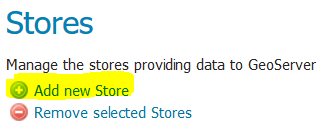
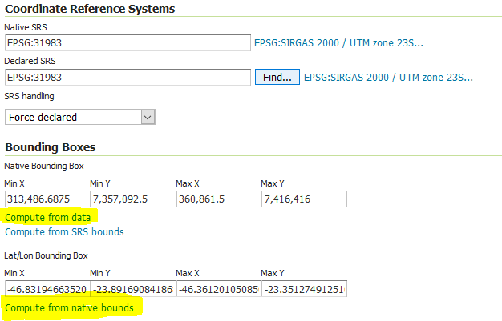

# Utilizando Dados Vetoriais com Vector Tiles, GeoServer, PostGIS e Openlayers #

## 1. Introdução ##

Servir dados geográficos vetoriais via web de forma interoperável e eficiente é um grande desafio enfrentado a muito tempo pela comunidade GIS. Muitos esforços nesta linha já foram feitos por diversas instituições. O [Open Geospatial Consortium](https://www.ogc.org/ "https://www.ogc.org/") (OGC) facilitou a disseminação de dados geoespaciais em formatos bem conhecidos via internet por meio de diversos [padrões](https://www.ogc.org/standards "https://www.ogc.org/standards") criados ao longo do tempo. Duas dessas especificações do OGC são especialmente relevantes para o contexto do presente artigo, são elas a spec do [Web Map Service](https://www.ogc.org/standards/wms "https://www.ogc.org/standards/wms") (WMS) e do [Web Feature Service](https://www.ogc.org/standards/wfs "https://www.ogc.org/standards/wfs") (WFS).

## 1.1 Web Map Service (WMS) ##

O WMS foi um dos primeiros padrões criados para suportar a criação e difusão de mapas via internet. Ele é basicamente um serviço de mapas que tem como objetivo fornecer dados espaciais já renderizados no servidor como imagem para consumo via web. Este serviço recebe uma consulta espacial do cliente, recupera os dados da fonte (que pode ser um Shapefile, Banco de Dados Espacial, etc) desenha em imagens com a estilização apropriada, e retorna para o cliente.

## 1.2 Web Feature Service (WFS) ##

Como o WMS somente retorna uma imagem com um mapa pronto, e não os dados em sí, a especificação WFS foi criada para atingir este fim de disponibilizar o dado. O WFS é mais um serviço que permite requisições espaciais só que, ao invés de renderizar os dados no servidor, ele somente retorna os dados consultados em algum dos formatos bem conhecidos para trânsito de dados vetoriais [Geography Markup Language](https://www.ogc.org/standards/gml "https://www.ogc.org/standards/gml") (GML), [GeoJSON](https://geojson.org "https://geojson.org/"), etc. Permitindo ao cliente manipular os dados da forma que quiser.

Tais padrões permitiram que diversos tipos de aplicações web fossem construídas utilizando-se de dados e mapas. Porém, alguns gargalos ainda existiam nessas duas abordagens. No caso do WMS, a renderização é feita no servidor no momento da request o que faz com que os serviços sejam rapidamente sobrecarregados. E o WFS tem o problema do peso das feições geográficas que ele trafega na rede. Caso o cliente faça uma request muito genérica que retorne muitas entidades, ele vai devolver as feições sem nenhum tipo de simplificação do dado para diminuir o tamanho da resposta.

## 1.3 Tiles do Google e Tile Map Service ##

Para superar o problema da renderização dos mapas no tempo de requisição, a Google iníciou uma abordagem diferente em que ela propõs a divisão do espaço geográfico em pequenos [quadrados (Tiles)](https://developers.google.com/maps/documentation/javascript/coordinates "https://developers.google.com/maps/documentation/javascript/coordinates") em diferentes resoluções (níveis de zoom). Com isso, a renderização é feita uma vez somente e os Tiles são armazenados como imagem em "diretórios" e para consumí-los o cliente precisa somente ter uma ferramente que implemente a lógica de recuperar cada imagem em cada nível de zoom, não tendo nenhum tipo de processamento espacial ou renderização nessas requisições.

A [Open Source Geospatial Foundation](https://www.osgeo.org/ "https://www.osgeo.org/") (OSGeo) também desenvolveu uma especificação que trabalha da mesma forma que o Google propôs, trazendo assim este esquema de servir dados para o mundo Open Source. As especificação chama-se [Tile Map Service](https://wiki.osgeo.org/wiki/Tile_Map_Service_Specification  "https://wiki.osgeo.org/wiki/Tile_Map_Service_Specification") (TMS).

Neste momento, o problema do gargalo de serviço de mapas estava resolvido. Porém, a interação dos usuários com o dado geográfico ainda fica bastante comprometida. Pois o que ele tem é uma imagem e não o dado em sí. E ainda havia o problema de transitar muitos dados via rede com o WFS.

## 1.4 Vector Tiles ##

EM 2014 a [Mapbox](https://www.mapbox.com/  "https://www.mapbox.com/") lança a primeira versão da sua proposta de [Vector Tiles](https://docs.mapbox.com/vector-tiles/specification/ "https://docs.mapbox.com/vector-tiles/specification/") que traz a mesma ideia das imagens em Tiles só que para arquivos vetoriais. Neste caso o dado não é desenhado, mas as geometrias são simplificadas (o número de pontos do dado original é reduzido) para cada nível de zoom fazendo com que os objetos vetoriais fiquem menores e eles são salvos em arquivos no formato MVT que é baseado no [Protocol Buffer](https://github.com/protocolbuffers/protobuf "https://github.com/protocolbuffers/protobuf"), da Google, que é um formato muito compacto.

Com a nova abordagem dos Vector Tiles as aplicações web podem alcançar um novo nível de interação com o dado espacial. Pois é possível desenvolver interações diretamente com as feições renderizadas ali no frontend mesmo que são recuperadas na medida em que o usuário vai navegando no mapa e não mais de uma vez só como era feito com WFS. Aqui cabe lembrar que as geometrias simplificadas dos Tiles vetoriais não devem ser usadas no contexto de edição, pois elas possuem degradação quanto ao dado original. Neste caso, serviços como o WFS se fazem necessários para recuperar a com específica com a qual se quer trabalhar conforme ela está armazenada na fonte.

Nos próximos capítulos será abordada uma das formas de se servir dados vetoriais utilizando tecnologias consolidadas do mercado GIS.

## 2. Ferramentas Necessárias ##

Para executar os passos deste tutorial, será necessário ter instalado as seguintes ferramentas:

- [Docker](https://www.docker.com/ "https://www.docker.com/")
- [NPM](https://www.npmjs.com/get-npm "https://www.npmjs.com/get-npm")
- [QGIS](https://www.qgis.org/pt_BR/site/forusers/download.html "https://www.qgis.org/pt_BR/site/forusers/download.html") (Somente para importar dados de Shapefile para o PostGIS)
- Este Repositório

## 3. Estrutura do Repositório ##

Este repositório tem a seguinte estrutura (em diretórios):

- [docker](docker "docker"): docker compose com um container de PostGIS e outro com o Geoserver
- [data](data "data"): dados em shapefile que serão importados para o PostGIS
- [app](app "app"): encontra-se a aplicação web com Openlayers que faz acesso aos dados expostos em Vector Tiles

## 4. Rodando Aplicações ##

## 4.1 PostGIS e Geoserver ##

Conforme descrito acima, o diretório docker possui um arquivos chamado docker-compose.yml. Nele estão as declarações para rodar os dois containers necessários para o nosso exemplo. Os containers referenciam as seguintes imagens docker:

- [mdillon/postgis:11](https://hub.docker.com/r/mdillon/postgis/ "https://hub.docker.com/r/mdillon/postgis/") (imagem do Postgres 11 com PostGIS)
- [heitorcarneiro/geoserver:2.15.2-java11-hotspot](https://hub.docker.com/r/heitorcarneiro/geoserver "https://hub.docker.com/r/heitorcarneiro/geoserver") (Imagem do Geoserver, agradecimentos ao Heitor por já ter feito ela com o Plugin de [Vector Tiles](https://docs.geoserver.org/stable/en/user/extensions/vectortiles/index.html "https://docs.geoserver.org/stable/en/user/extensions/vectortiles/index.html") do Geoserver)

Para rodar os containers vamos ao diretório do docker e utilizamos o seguinte comando:

    docker-compose up -d

Tendo o seguinte resultado:

    docker ps

    CONTAINER ID        IMAGE                                            COMMAND                  CREATED             STATUS                             PORTS                    NAMES
    6de8b7430dc5        heitorcarneiro/geoserver:2.15.2-java11-hotspot   "/usr/local/bin/star…"   20 seconds ago      Up 17 seconds (health: starting)   0.0.0.0:8080->8080/tcp   docker_geoserver_1
    d02fb3f6be08        mdillon/postgis:11                               "docker-entrypoint.s…"   21 seconds ago      Up 19 seconds                      0.0.0.0:5432->5432/tcp   docker_db_1

Neste momento o geoserver já está acessível em [http://localhost:8080/geoserver](http://localhost:8080/geoserver "http://localhost:8080/geoserver"). As credenciais de acesso são:

- usuário: admin
- senha: geoserver

E o postgres possui um banco de dados de nome geoserver que será utilizado como fonte de dados do Geoserver a seguir. As endereço do banco e credenciais de acesso são:

- host: localhost
- porta: 5432
- usuário: geoserver
- senha: geoserver

## 4.2 Importando Dados ##

Para importar os dados utilizados neste exemplo, vamos utilizar o QGIS. Mas pode-se utilizar outras ferramentas para realizar tal objetivo. Antes de realizar a importação, é necessário descompactar o arquivo ZIP da pasta data deste repositório. A versão utilizada neste tutorial é a 2.18.21.

Primeiro clique no botão de adicionar camada vetorial:

Primeiro em buscar e selecione o arquivo **.shp**:

Depois clique em **Abrir**.

O Sistema pedirá para você especificar a projeção do dado, digite o número 31983 no campo **Filtro**.

Neste momento você poderá ver o dado de logradouros na área de desenho. Agora vamos criar uma conexão entre o QGIS e o banco de dados. Para isso, vá na árvore do cando esquerdo e clique com o botão direito no ícone do PostGIS e depois clique em Nova Conexão. Preencha a tela de conexão da seguinte maneira e clique em **Ok**:

Você poderá ver uma nova conexão de nome vector_tiles_postgis na árvore de navegação. Depois vá em Banco de Dados no menu superior e abra do **Gerenciador DB**:

Conecte-se ao banco de dados, depois selecione o schema public na árvoque e clique no **botão de importar dados**:

Aponte o nome da tabela de resultado como "logradouro" e clique em **Ok**. Este processo irá demorar um bom tempo, pois é um conjunto relativamente grande de dados. Depois que os dados forem importados para o banco, você receberá uma mensagem de conclusão.

Terminada a importação, será possível ver a tabela logradouro no banco de dados.

## 4.3 Servindo Vector Tiles no Geoserver ##

Agora serão feitas as configurações para servir os dados importados no PostGIS como Vector Tiles via Geoserver. Primeiramente vamos acessar a interface do Geoserver, fazer o login e depois criar um Workspace como Default:
 

Depois, criamos um novo Store do tipo PostGIS:

Atente-se para o detalhe de que aqui nos parâmetros de conexão colocamos como host **postgis** ao invés de **localhost**, isso ocorre porque o geoserver e o postgis se possuem acesso um ao outro por dentro da rede do docker.

Criada a conexão com o Store do banco, você será redirecionado para uma tela de novos layers, clique em Publish:

Na publicação do Layer só é necessário clicar em **Compute from data** e **Compute from native bounds** na parte de CRS na aba data:

Depois disso, vá à aba **Tile Caching** e ative a opção **application/vnd.mapbox-vector-tile**, podemos também desmarcar as opções de JPG e PNG que vem marcadas como padrão. Feito isso, clique em **Save**:

Pronto, os dados de logradouros já estão devidamente publicados.

## 4.4 Consumindo Vector Tiles com Openlayers ##

Na pasta **app** deste repositório temos uma aplicação simples que utiliza Javascript com a biblioteca Openlayers para acessar os dados de logradouros publicados no passo anterior. Para rodar a aplicação, é necessário ir ao diretório **app** e rodar o seguinte comando para instalar as dependências:

    npm install

Depois rodamos a aplicação:

    npm run start

Ela fica acessível em [http://localhost:4200](http://localhost:4200 "http://localhost:4200"). O mapa é bem simples, possui como pano de fundo uma camada Open Street Maps e o dado de logradouros é desenhado por cima. Ao passar o mouse nas feições, você visualiza o atributo nome dela, demonstrando assim que o que temos ali no front é a geometria e seus atributos recuperados via Vector Tiles. O código que permite essa interação pode ser visualizado em [app/index.js](app/index.js "app/index.js")

## 5. Conclusão ##

Essa forma de se servir dados vetoriais é bastante interessante para o desenvolvimento de aplicações com características de GIS para a Web, pois permite desenvolvimento de interações mais refinadas que os serviços de mapas não permitiam por disponibilizar somente as imagens. Existem diversas ferramentas GIS de mercado que já dão suporte a esse formato de dados. Porém, com o desenho sendo feito no frontend, perde-se a capacidade de fazer um gerenciamento de estilos no servidor, e isso é transferido para a aplicação que consome o dado. E como os estilos são definidos via código, a criação ou mudanças na exibição do mapa acabam sendo feitas com mudanças de código da aplicação no frontend.

Existem outras formas de expor Vector Tiles via Web, não necessariamente precisamos utilizar Geoserver, apesar de ser uma excelente ferramenta para isso. No respositório [Awesome Vector Tiles](https://github.com/mapbox/awesome-vector-tiles "https://github.com/mapbox/awesome-vector-tiles") há uma lista de ferramentas que foram desenvolvidas por diversos membros da comunidade GIS para lidar com este tipo de dado. Pretendo explorar algumas dessas ferramentas em trabalhos futuros.